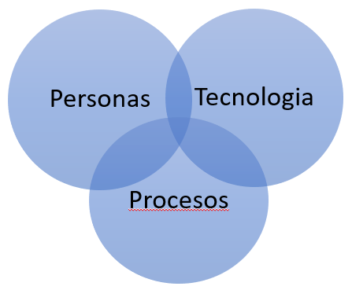

# U1 - Introducción a la seguridad

## 1. Introducción a la seguridad de la información

La **seguridad de la información** es un tema crítico en la actualidad, ya que las organizaciones dependen cada vez más de la tecnología para almacenar y procesar datos. La seguridad de la información se refiere a la protección de la información contra el acceso no autorizado, la divulgación, la alteración o la destrucción.

La seguridad de la información es esencial para proteger la privacidad, la integridad y la disponibilidad de los datos.

## Objetivos

- Definir la seguridad de la información y su importancia.
- Identificar las amenazas a la seguridad de la información.
- Describir las medidas de seguridad de la información.
- Explicar la importancia de la seguridad de la información en las organizaciones.

## Contenido

### 1.1 Conceptos básicos

[Glosario PDF](./resources/Glosario%20de%20Ciberseguridad%20-%20GPNSIE%20FINAL.pdf)

[Glosario](./resources/Glosario%20de%20Ciberseguridad.md)

### 1.1.1 Gestión de la información

La **información** se ha convertido en el **activo** más valioso de cualquier empresa, y la mayoría de las empresas se esfuerzan por maximizar su valor para mejorar las operaciones comerciales, volverse más flexibles, adaptarse al cambio y tomar decisiones comerciales informadas.

Debido a que una mejor información conduce a mejores decisiones, la calidad y cantidad de información que tenemos es un factor importante en nuestro éxito.

La gestión de la información se refiere a la recopilación, el almacenamiento, la seguridad, el mantenimiento, el archivo y la destrucción de información de cualquier tipo y formato. Especifica cómo las organizaciones deben usar su activo más valioso y desbloquear su potencial para contribuir al éxito general de la empresa.

Vivimos en un entorno empresarial altamente competitivo, donde el uso eficiente del conocimiento y la información puede ser uno de los aspectos más importantes del éxito de una organización. En pocas palabras, la información es la “moneda organizacional” para la toma de decisiones.

Un programa eficaz de gestión de la información es un componente fundamental de toda organización, ya que garantiza que los empleados manejen información de alta calidad para tomar decisiones y cumplir con sus responsabilidades.

#### ¿Qué es la Gestión de la Información?

La gestión de la información es el proceso de gestión del ciclo de vida completo de la información, desde su identificación y recopilación hasta su eliminación mediante el archivo o la eliminación. engloba todos los datos físicos y electrónicos recopilados por una empresa de sus clientes, empleados y proveedores.

La gestión de la información, comúnmente conocida como gestión de la información empresarial, comprende una amplia gama de actividades, como la gestión de documentos, la gestión de registros, la gestión de contenido empresarial, la búsqueda empresarial, la gestión de activos digitales y la colaboración.

Los datos, los registros, la infraestructura, los sistemas de información, los procesos empresariales y, lo que es más importante, las PERSONAS forman parte del ciclo de vida de la gestión de la información empresarial.

#### 5 áreas clave de la gestión de la información

Las cinco áreas clave de la gestión de la información son la recopilación, el almacenamiento, la distribución, el archivo y la destrucción de la información.

1. **Colección**
  En esta etapa, debemos examinar cómo la empresa recopila información, ya sea interna o externamente, electrónicamente o en papel, verbalmente, por escrito, en audio o video.  
  En este punto, es fundamental recopilar solo la información necesaria para ahorrar costos de almacenamiento, evitar analizar datos innecesarios para el gobierno del negocio y garantizar que la información obtenida sea de buena calidad.

2. **Almacenamiento**
  Debemos determinar dónde se almacenará la información recopilada en la fase anterior. Los documentos en papel deben almacenarse y organizarse en gabinetes físicos con medidas de resistencia al fuego. La información electrónica, por su parte, puede mantenerse en bases de datos, sistemas de gestión documental (Alfresco), sistemas ERP, etc.  
  También debemos identificar y configurar el acceso de los usuarios, el control de versiones y cambios, las copias de seguridad y las pistas de auditoría.

3. **Distribución**
  Este paso implica decidir cómo se debe distribuir la información, en qué formato, a quién, con qué frecuencia y a través de qué medios, entre otras cosas.  
  La información solo es valiosa cuando se presenta a la persona adecuada para que se puedan tomar las medidas adecuadas. Esta es una fase crítica ya que ayuda al éxito general de su programa de gestión de la información.

4. **Archivar**
  El archivado es el proceso de almacenamiento seguro de información inactiva en cualquier formato (digital y en papel) que ya no usa regularmente para la retención a largo plazo. Esta información sigue siendo importante para las organizaciones y debe conservarse para futuras referencias o cumplimiento normativo.  
  Debe indicar claramente dónde se archivará la información y por cuánto tiempo.

5. **Destrucción**
  Según diversas normas y reglamentos, la información no debe conservarse o conservarse por más tiempo del necesario, requiriendo un proceso de destrucción para la información que ha perdido su utilidad.  
  Este paso es fundamental porque elimina multas y sanciones por incumplimiento de diversas leyes y reglamentos, además de reducir los costos de almacenamiento.

#### Importancia de la gestión de la información

Todos necesitamos un fácil **acceso a la información correcta** en el **momento adecuado**. Lograr esta transformación tiene un gran impacto tanto en la cultura como en los resultados de la organización.

Al vincular personas, procesos y tecnología, las empresas conocerán el valor total de su información. Cuando la información se maneja de manera efectiva y solo se conserva información de alta calidad, las organizaciones pueden convertirla en conocimiento para obtener información adicional sobre su negocio y redirigir sus operaciones hacia actividades más rentables.

#### Beneficios de la gestión de la información

- **Mejora la toma de decisiones**
  La gestión de la información proporciona a los empleados la información correcta en el momento adecuado, lo que les permite tomar decisiones informadas y basadas en datos.

- **Aumenta la eficiencia**
  La gestión de la información garantiza que los empleados tengan acceso a la información que necesitan para realizar su trabajo de manera eficiente.

- **Mejora la colaboración**
  La gestión de la información facilita la colaboración entre los empleados al proporcionarles acceso a la información que necesitan para trabajar juntos en proyectos.

- **Reduce los riesgos**
  La gestión de la información ayuda a reducir los riesgos al garantizar que la información se almacene de manera segura y se elimine de manera segura cuando ya no sea necesaria.

- **Mejora la calidad de los datos**
  La gestión de la información garantiza que los datos se recopilen, almacenen y distribuyan de manera coherente y precisa, lo que mejora la calidad de los datos.

- **Aumenta la satisfacción del cliente**
  La gestión de la información garantiza que los empleados tengan acceso a la información que necesitan para brindar un excelente servicio al cliente.

#### Fundamento teorico. Definiciones

- **Gestión de la información:**
  - «la gestión de información es todo lo que tiene que ver con obtener la información correcta, en la forma adecuada, para la persona indicada, al costo correcto, en el momento oportuno, en el lugar indicado para tomar la acción precisa.» Woodman, Information management in large organizations. London 1985.

  - «la coordinación eficiente y eficaz de la información procedente de fuentes internas y externas.» White, Information management: from strategies to action. London 1985.

  - «[...] el proceso mediante el cual se obtienen, despliegan o utilizan recursos básicos (económicos, físicos, humanos, materiales) para manejar información dentro y para la sociedad a la que sirve. Tiene como elemento básico la gestión del ciclo de vida de este recurso y ocurre en cualquier organización. Es propia también de unidades especializadas que manejan este recurso en forma intensiva, llamadas unidades de información.» Ponjuán, Gestión de la Información: dimensiones e implementación para el éxito organizacional. Rosario 2004.

#### Componentes de la gestión de la información

La gestión de la información consta de varios componentes clave, que incluyen:

- **Recopilación de información**
  La recopilación de información implica la identificación y recopilación de datos de diversas fuentes, tanto internas como externas.

- **Almacenamiento de información**
  El almacenamiento de información implica la organización y el almacenamiento seguro de datos en una variedad de formatos, incluidos papel y digital.

- **Distribución de información**
  La distribución de información implica la entrega de datos a las personas adecuadas en el momento adecuado y en el formato adecuado.

- **Archivo de información**
  El archivo de información implica el almacenamiento seguro de datos inactivos para su retención a largo plazo.

- **Destrucción de información**
  La destrucción de información implica la eliminación segura de datos que ya no son necesarios.

#### Desafíos de la gestión de la información

- **Volumen de datos**
  La cantidad de datos que las organizaciones recopilan y almacenan ha aumentado exponencialmente en los últimos años, lo que dificulta la gestión de la información.

- **Calidad de los datos**
  La calidad de los datos es un desafío importante para las organizaciones, ya que los datos inexactos o incompletos pueden llevar a decisiones comerciales erróneas.

- **Seguridad de los datos**
  La seguridad de los datos es un desafío crítico para las organizaciones, ya que los datos confidenciales pueden ser vulnerables a ataques cibernéticos y violaciones de datos.

- **Cumplimiento normativo**
  Las organizaciones deben cumplir con una variedad de regulaciones y normativas relacionadas con la gestión de la información, lo que puede ser un desafío para muchas organizaciones.

- **Tecnología obsoleta**
  La tecnología obsoleta puede dificultar la gestión de la información, ya que las organizaciones pueden tener dificultades para acceder, almacenar y distribuir datos de manera eficiente.

#### Stakeholders y roles

- **Information Managers**: son responsables de supervisar la gestión de la información en una organización y garantizar que se cumplan los objetivos y las políticas de la empresa.

- **Data Owners**: son los responsables de los datos en una organización y garantizan que los datos se recopilen, almacenen y distribuyan de manera segura y eficiente.

- **Data Stewards**: son los responsables de la calidad de los datos en una organización y garantizan que los datos sean precisos, completos y coherentes.

- **Bussines Users**: son los empleados que utilizan la información en una organización y dependen de ella para tomar decisiones informadas y realizar su trabajo de manera eficiente.

- **IT Professionals**: son los profesionales de TI que son responsables de implementar y mantener los sistemas de información en una organización y garantizar que los datos se almacenen y distribuyan de manera segura.

### 1.1.2 Gestión de sistemas de información

La **gestión de sistemas de información (MIS)** La gestión de sistemas de información es la disciplina encargada del **diseño, la implementación, el monitoreo y el mantenimiento** de sistemas tecnológicos de comunicación y administración, que permiten a las organizaciones recolectar, almacenar, procesar y distribuir la información de manera eficiente y efectiva.

Los sistemas de información incluyen esencialmente elementos de hardware y de software, pero también se encargan de supervisar los procedimientos y políticas que garantizan el uso adecuado de la información.

#### ¿Qué es un sistema de información?

Un sistema de información es un conjunto de componentes interrelacionados que trabajan juntos para **recopilar**, **procesar**, **almacenar** y **distribuir información** para apoyar la toma de decisiones y el control en una organización.

la gestión de sistemas de información implica la administración y el desarrollo de vínculos entre las distintas áreas de la **gestión humana y la innovación tecnológica**. Es imprescindible que ambos elementos se coordinen y evalúen de forma casi constante.

De esa manera lo consignan [George Anthony Gorry](https://www.google.com.uy/search?tbo=p&tbm=bks&q=inauthor:%22George+Anthony+Gorry%22) y [Michael S. Scott Morton](https://mitsloan.mit.edu/faculty/directory/michael-stewart-scott-morton) en [_A framework for management information systems_](https://books.google.com.uy/books?id=t-PntwAACAAJ&printsec=frontcover&dq=editions:ISBN137927415X&hl=es) (1971): la evolución tecnológica de los sistemas de información no puede estar separada de la innovación en los métodos de gestión.

#### Componentes de un sistema de información

Un sistema de información consta de cinco componentes principales: hardware, software, datos, procedimientos y personas.

- **Hardware**: son los dispositivos físicos que componen el sistema de información, como computadoras, servidores, impresoras, escáneres, etc.

- **Software**: son los programas de computadora que se utilizan para procesar la información, como sistemas operativos, aplicaciones de software, etc.

- **Datos**: son los hechos que se recopilan y procesan en el sistema de información, como números, texto, imágenes, etc.

- **Procedimientos**: son las reglas y pautas que se siguen para recopilar, procesar, almacenar y distribuir información en el sistema de información.

- **Personas**: son los usuarios del sistema de información, como empleados, clientes, proveedores, etc.

#### Tipos de sistemas de información

Existen varios tipos de sistemas de información, que se pueden clasificar en función de su función y su uso.

Algunos de los sistemas de información más comunes en la actualidad son:

- **Sistemas de información de gestión empresarial:** estos sistemas integran y automatizan diferentes áreas funcionales de una empresa, tales como finanzas, recursos humanos, inventarios, compras, producción y ventas. Algunos ejemplos de sistemas de información de gestión empresarial son los sistemas ERP (Enterprise Resource Planning) como SAP y los sistemas CRM (Customer Relationship Management) como Upnify y Salesforce.

- **Sistemas de información de recursos humanos:** estos sistemas ayudan a las empresas a gestionar sus empleados, desde la contratación hasta la seguridad social, pasando por la liquidación de sueldos y la gestión de licencias, entre otros. Algúnos ejemplos de sistemas de información de recursos humanos son los sistemas de nómina y los sistemas de gestión de talento como Workday, SAP SuccessFactors y Oracle HCM Cloud.

- **Sistemas de información de marketing:** estos sistemas ayudan a las empresas a comprender a sus clientes y al mercado, desde la investigación de ambos elementos hasta la gestión de las relaciones con sus públicos, incluyendo la segmentación de mercado y el análisis de la competencia. Algunos ejemplos de sistemas de información de marketing son los sistemas de automatización de marketing y los sistemas de análisis de datos como Google Analytics.

- **Sistemas de información contable:** estos sistemas ayudan a las empresas a llevar registros contables precisos y cumplir con sus obligaciones fiscales. Algunos ejemplos de sistemas de información contable son los sistemas de contabilidad financiera y los sistemas de contabilidad de costos como QuickBooks y Sage.

- **Sistemas de información geográfica:** estos sistemas ayudan a las organizaciones a entender y visualizar mejor la información geográfica para apoyar la toma de decisiones y la planificación estratégica. Algunos ejemplos de sistemas de información geográfica son Google Maps y ArcGIS.

- **Sistemas de información de salud:** estos sistemas específicos se utilizan en centros de salud y similares. Permiten gestionar información relacionada con los pacientes, así como también historiales médicos electrónicos, registros de tratamientos y resultados de exámenes, entre muchas otras variables. Algunos ejemplos de sistemas de información de salud son los sistemas de información hospitalaria y los sistemas de información de gestión de la salud como Epic y Cerner.

- **Sistemas de información de fabricación:** estos sistemas se utilizan para planificar, programar y controlar las operaciones de fabricación o producción de bienes en una empresa. Algunos ejemplos de sistemas de información de fabricación son los sistemas MES (Manufacturing Execution Systems) y los sistemas de planificación de recursos de fabricación (MRP II).

- **Sistemas de información de logística:** ayudan a las organizaciones a planificar, operar y optimizar sus redes de transporte, distribución y logística. Algunos ejemplos de sistemas de información de logística son los sistemas de gestión de almacenes y los sistemas de gestión de transporte como SAP TM y Oracle WMS.

- **Sistemas de información de seguridad cibernética:** ayudan a las organizaciones a protegerse de las amenazas cibernéticas y a garantizar la confidencialidad, integridad y disponibilidad de la información en sus sistemas y redes, tanto internas como externas. Algunos ejemplos de sistemas de información de seguridad cibernética son los sistemas de detección y prevención de intrusiones (IDS/IPS) y los sistemas de gestión de eventos e información de seguridad (SIEM).

#### Herramientas de gestión de sistemas de información

Existen varias herramientas de gestión de sistemas de información que pueden ayudar a las organizaciones a administrar sus sistemas de información de manera más eficiente y efectiva.

Algunas de las herramientas de gestión de sistemas de información más comunes son:

- **Sistemas de gestión de bases de datos:** ayudan a las organizaciones a almacenar, organizar y recuperar datos de manera eficiente y segura. Algunos ejemplos de sistemas de gestión de bases de datos son MySQL, Microsoft SQL Server y Oracle Database.

- **Sistemas de gestión de contenido:** ayudan a las organizaciones a crear, almacenar, organizar y distribuir contenido digital, como documentos, imágenes, videos y archivos multimedia. Algunos ejemplos de sistemas de gestión de contenido son WordPress, Drupal y Joomla.

- **Sistemas de gestión de redes:** ayudan a las organizaciones a monitorear, administrar y optimizar sus redes de comunicación, incluyendo la infraestructura de red, los dispositivos de red y los servicios de red. Algunos ejemplos de sistemas de gestión de redes son SolarWinds, Nagios y PRTG Network Monitor.

- **Sistemas de gestión de seguridad:** ayudan a las organizaciones a proteger sus sistemas de información y redes contra amenazas cibernéticas, incluyendo virus, malware, ransomware y ataques de denegación de servicio. Algunos ejemplos de sistemas de gestión de seguridad son Symantec Endpoint Protection, McAfee e IBM QRadar.

- **Sistemas de gestión de servicios de TI:** ayudan a las organizaciones a administrar y optimizar sus servicios de tecnología de la información, incluyendo la gestión de incidentes, problemas, cambios y activos. Algunos ejemplos de sistemas de gestión de servicios de TI son ServiceNow, BMC Remedy y Jira Service Management.

### 1.1.3 Gestión de riesgos

La **Gestión de Riesgos y Cumplimiento (GRC)** es un enfoque integrado para la gestión de la información empresarial que aborda los riesgos y el cumplimiento normativo de la información de una organización.

En términos simples, **gobernanza**, **riesgo** y **compliance**, o GRC, es la estrategia y estructura que mantiene a una organización segura y en marcha. La gobernanza corporativa, como el gobierno de una ciudad o un país, define los principios y acuerdos bajo los cuales viven las personas –y brinda los controles y apoyo necesarios para lograr las metas generales–. La gestión de riesgos identifica amenazas a la vez que introduce procesos para protegerse de ellas. Y, por último, la gestión de compliance garantiza que la organización cumpla con las normativas, siga las prácticas contables adecuadas, y opere éticamente.

[GRC Definition](https://www.oceg.org/ideas/what-is-grc/)

### La primera investigación académica sobre gobernanza, riesgo y compliance [define a GRC](https://www.oceg.org/about/what-is-grc/) como "la colección integrada de capacidades que le permiten a una organización alcanzar objetivos de manera confiable, abordar la incertidumbre, y actuar con integridad". Desde entonces, las tecnologías digitales y los volúmenes de datos han explotado, pero los objetivos y valores de negocio centrales se mantienen

## Definición y significado de GRC

En términos simples, gobernanza, riesgo y compliance, o GRC, es la estrategia y estructura que mantiene a una organización segura y en marcha. La gobernanza corporativa, como el gobierno de una ciudad o un país, define los principios y acuerdos bajo los cuales viven las personas –y brinda los controles y apoyo necesarios para lograr las metas generales–. La gestión de riesgos identifica amenazas a la vez que introduce procesos para protegerse de ellas. Y, por último, la gestión de compliance garantiza que la organización cumpla con las normativas, siga las prácticas contables adecuadas, y opere éticamente.

### GRC es la estrategia y estructura que mantiene a una organización segura y en marcha

Piense en la gobernanza, la gestión de riesgos, y el compliance como las tres partes de un trípode que mantiene el equilibrio de una organización:

### 1\. Gobernanza corporativa

La G de GRC es por "gobernanza". Más que un simple libro de reglas, la gobernanza ayuda a conectar los silos de la organización para garantizar que las actividades en toda la empresa se alineen con los objetivos estratégicos. Brinda soporte a un lugar de trabajo coordinado y productivo en el que todas las partes interesadas –internas y externas– comprenden cómo encajan sus contribuciones e intereses con los de los demás. Ayuda a prevenir redundancias, iniciativas contradictorias, y costos innecesarios. Con enfoque en la gestión de recursos y la rendición de cuentas, ofrece los controles y balances necesarios para “mantener la casa en orden”. Su objetivo es garantizar las operaciones basadas en principios, el compliance de los valores corporativos, y las prácticas de negocio éticas. La gobernanza también es un mecanismo para reducir el riesgo y garantizar el compliance mediante la validación y gestión de la información, sus fuentes y su manejo.

### 2\. Gestión y mitigación de riesgos

La R de GRC es por "riesgo". Cualquier cosa que podría conducir a un resultado negativo en cualquier aspecto del negocio presenta un riesgo. Algunos riesgos, como una pandemia, están fuera del control de cualquier persona. Otros provienen de adentro y se deben a debilidades operativas, técnicas o de procedimiento. Otros se deben a amenazas externas como [ataques a la ciberseguridad](https://www.sap.com/latinamerica/products/financial-management/what-is-cybersecurity.html) y fraudes.

La tecnología juega un papel vital en la detección temprana del riesgo –pero la gestión del riesgo empresarial requiere de más que solo tecnología–. Los valores, procesos y compromiso de la organización son vitales para la forma en que gestiona el riesgo. Un artículo reciente de [Forbes](https://www.forbes.com/sites/toddwasserman/2020/12/18/saps-alicia-tillman-on-improvising-a-marketing-plan-during-a-pandemic/?sh=1157f4f33343) sostiene la creciente necesidad y deseo de contar con estrategias de gestión de riesgos empresariales (ERM) que usan "soluciones proactivas e integradas que abarcan personas, datos e infraestructura".

Los riesgos de negocio se dividen en cinco categorías básicas, y las estrategias de ERM y GRC de una organización deben estar preparadas para anticipar, mitigar y, lo que es más importante, prevenir todas o cualquiera de ellas.

- **El riesgo de rendimiento u operativo** tiene el conjunto de límites más amplio y la mayor variedad potencial. Proviene de fallos (accidentales o intencionados) en la estructura, sistemas, personas, productos o procesos implicados en cualquier aspecto de las operaciones de negocios.

- **El riesgo de compliance** resulta de violaciones a leyes, regulaciones, códigos de conducta o estándares de práctica establecidos dentro de una industria u organización.

- **El riesgo de TI** surge de la falla o el uso indebido de TI, lo cual lleva a pérdidas o resultados de negocios negativos. Esto puede ir desde fallas accidentales de TI hasta fraude intencional, pirateo o ciberataques.

- **El riesgo financiero**  como categoría de riesgo de negocios significa perder dinero en una inversión o iniciativa de negocios. Esto puede incluir riesgo crediticio o de liquidez, o combinarse con un riesgo operativo como fraude o mala gestión.

- ****El riesgo de reputación** puede deberse a fallos en cualquiera de las cuatro categorías anteriores, los cuales conducen a una debilitada percepción pública del negocio. El riesgo de reputación ofrece menos pérdidas cuantificables pero, sin embargo, potencialmente es uno de los más destructivos para cualquier empresa o marca.

El software para GRC ayuda a detectar amenazas a fin de ayudar a las organizaciones a supervisar y gestionar el riesgo de forma proactiva.

### 3\. Gestión del compliance

La C de GRC es por "compliance". En muchos casos, los fallos en el compliance de la normativa pueden provocar enormes pérdidas financieras y graves daños a la reputación. En 2019, solo las [multas](https://www.csoonline.com/article/3410278/the-biggest-data-breach-fines-penalties-and-settlements-so-far.html) por incumplimiento de normativas de datos alcanzaron un máximo histórico, y la International Trade Commission de Estados Unidos publicó que en 2019 las empresas con sede en la UE habían gastado hasta el 4% de sus ingresos globales anuales en [multas del GDPR](https://www.usitc.gov/publications/332/executive_briefings/gdpr_enforcement.pdf). Y cada año se gastan miles de millones en respuesta a otros desafíos de compliance legal y regulatorio.

Sin embargo, aunque es complejo y difícil de mantener, el compliance es una práctica basada en reglas y, por lo tanto, es uno de los riesgos más evitables si se gestiona bien. Las tecnologías inteligentes y las [soluciones para software para GRC](https://www.sap.com/latinamerica/products/financial-management/grc.html) modernas están en primer plano en lo que respecta a la gestión de datos, analíticas predictivas e información estratégica en tiempo real que se necesitan para mantener una estrategia de compliance sólida y actualizada.

## ¿Qué es un marco de GRC y por qué es importante?

Un marco de GRC integra sistemas y procesos en toda la empresa para supervisar todos los aspectos de la gobernanza, la gestión de riesgos empresariales y el compliance. Brinda el enfoque estructurado necesario para alinear la estrategia de negocio de una organización con su tecnología de la información –de modo que pueda gestionar el riesgo de manera eficaz y cumplir con los requisitos de compliance–. El GRC controla el modo de operar de la organización –y no lo que hace–. Por lo tanto, no se trata de fabricación o servicios minoristas o profesionales, sino de la forma en que la organización trabaja para cumplir con su misión, en cualquier campo en el que opera –haciendo negocios de manera ética, prudente y responsable–.

¿Por qué un marco de GRC sólido es más importante que nunca? Porque las empresas de hoy se enfrentan a complejidades sin precedentes. En su informe [Global Business Risk Report](https://www.dnb.com/perspectives/finance-credit-risk/quarterly-global-business-risk-report.html) del tercer trimestre de 2020, Dun & Bradstreet clasifica en un nivel récord la puntuación del riesgo de impacto en el negocio global. Además, un [estudio reciente](https://cybersecurityventures.com/hackerpocalypse-cybercrime-report-2016/) prevé que para 2025, el costo global de los delitos de ciberseguridad y las violaciones a los datos superará los USD 10 billones –más del triple que la cifra de 2015–. En respuesta a estos riesgos modernos, hubo también un considerable aumento de los organismos reguladores globales. The [Financer](https://thefinanser.com/2017/01/bank-regulations-change-every-12-minutes.html/) informa que actualmente hay más de 250 organismos de este tipo solo en el sector bancario, lo cual lleva a un cambio en las regulaciones bancarias cada 12 minutos aproximadamente.

## ¿Quién es responsable del GRC?

La responsabilidad de establecer y mantener los planes y procesos de GRC generalmente recae en los principales ejecutivos financieros y de compliance regulatorio (CFO y CCO) y sus equipos –con soporte de TI, RR. HH. y líderes de equipos operativos de toda la organización–. Sin embargo, una cosa es diseñar una excelente estrategia de GRC. Pero para que sea eficaz, debe incorporarse e integrarse con éxito dentro de las actividades de trabajo diarias de toda la empresa. Las mejores estrategias de GRC y gestión de riesgos adoptan un enfoque people-first para que todo el personal tenga interés en ayudar a garantizar la sostenibilidad del negocio.

### Roles y responsabilidades en GRC V1

- **Risk Assessment and Management**
  - Identifica, evalúa y mitiga los riesgos en toda la empresa.
  - Desarrolla y mantiene un programa de gestión de riesgos efectivo.
  - Proporciona informes regulares sobre el estado de los riesgos en toda la empresa.

- **Compliance Management**
  - Asegura que la empresa cumpla con las leyes y regulaciones aplicables.
  - Desarrolla y mantiene un programa de compliance efectivo.
  - Proporciona informes regulares sobre el estado del compliance en toda la empresa.

- **Policy Development**
  - Crea, distribuye y mantiene políticas y procedimientos de compliance.
  - Asegura que las políticas y procedimientos de compliance se cumplan en toda la empresa.
  - Proporciona informes regulares sobre el estado de las políticas y procedimientos de compliance en toda la empresa.

- **Monitoring and Auditing**
  - Planifica, ejecuta y gestiona auditorías internas y externas.
  - Identifica y responde a incidentes de seguridad y compliance.
  - Proporciona informes regulares sobre el estado de las auditorías y los incidentes en toda la empresa.

- **Training and Education**
  - Proporciona capacitación y educación sobre riesgos y compliance a los empleados.
  - Asegura que los empleados comprendan y cumplan con las políticas y procedimientos de compliance.
  - Proporciona informes regulares sobre el estado de la capacitación y la educación en toda la empresa.

- **Incident Response and Recovery**
  - Detecta, investiga y responde a incidentes de seguridad y compliance.
  - Recupera y restaura la operación normal de la empresa después de un incidente.
  - Proporciona informes regulares sobre el estado de los incidentes y la recuperación en toda la empresa.

- **Data Protection and Privacy**
  - Protege los datos de la empresa de amenazas internas y externas.
  - Cumple con las leyes y regulaciones de privacidad de datos aplicables.
  - Proporciona informes regulares sobre el estado de la protección de datos y la privacidad en toda la empresa.

- **Cross-Functional Collaboration**
  - Colabora con otros departamentos y equipos para garantizar la integración efectiva de GRC en toda la empresa.
  - Asegura que los procesos de GRC sean coherentes y eficientes en toda la empresa.
  - Proporciona informes regulares sobre el estado de la colaboración interfuncional en toda la empresa.

Los analistas GRC y los profesionales de GRC son responsables de implementar y mantener los programas de gobernanza, riesgo y compliance de una organización. Trabajan en estrecha colaboración con los principales ejecutivos financieros y de compliance regulatorio, así como con otros líderes de la organización, para garantizar que los programas de GRC sean efectivos y eficientes.

### 12 Roles comunes y responsabilidades en GRC

| Rol | Descripción |
| --- | ----------- |
| **Board of directors** | Este grupo es fundamental para establecer la dirección y las prioridades de GRC en toda la organización. Determina qué normas y reglamentos son necesarios para el cumplimiento y alinea la estrategia de GRC con los objetivos empresariales. |
| **Chief financial officer** | El CFO es responsable de supervisar la gestión de riesgos financieros y de compliance en toda la organización. Trabaja en estrecha colaboración con otros líderes de la organización para garantizar que los programas de GRC sean efectivos y eficientes. |
| **Operations managers from relevant departments** | Los gerentes de operaciones de los departamentos relevantes son responsables de implementar y mantener los programas de GRC en sus áreas respectivas. Trabajan en estrecha colaboración con los analistas GRC y otros profesionales de GRC para garantizar que los programas de GRC sean efectivos y eficientes. |
| **Representatives from relevant departments** | Los representantes de los departamentos relevantes son responsables de proporcionar información y apoyo a los programas de GRC en sus áreas respectivas. Trabajan en estrecha colaboración con los analistas GRC y otros profesionales de GRC para garantizar que los programas de GRC sean efectivos y eficientes. |
| **Contract managers from relevant department** | Los gerentes de contratos de los departamentos relevantes son responsables de garantizar que los contratos de la organización cumplan con las leyes y regulaciones aplicables. Trabajan en estrecha colaboración con los analistas GRC y otros profesionales de GRC para garantizar que los contratos de la organización sean efectivos y eficientes. |
| **Chief information security officer (CISO)** | El CISO es responsable de supervisar la seguridad de la información y la protección de datos en toda la organización. Trabaja en estrecha colaboración con los analistas GRC y otros profesionales de GRC para garantizar que los programas de GRC sean efectivos y eficientes. |
| **Data protection officer (DPO) or legal counsel** | El DPO o el asesor legal son responsables de garantizar que la organización cumpla con las leyes y regulaciones de privacidad de datos aplicables. Trabajan en estrecha colaboración con los analistas GRC y otros profesionales de GRC para garantizar que los programas de GRC sean efectivos y eficientes. |
| **GRC Lead** | El líder de GRC es responsable de supervisar la implementación y el mantenimiento de los programas de GRC en toda la organización. Trabaja en estrecha colaboración con los principales ejecutivos financieros y de compliance regulatorio, así como con otros líderes de la organización, para garantizar que los programas de GRC sean efectivos y eficientes. |
| **Cybersecurity analyst(s)** | Los analistas de ciberseguridad son responsables de identificar y mitigar las amenazas de seguridad cibernética en toda la organización. Trabajan en estrecha colaboración con los analistas GRC y otros profesionales de GRC para garantizar que los programas de GRC sean efectivos y eficientes. |
| **Compliance analyst(s)** | Los analistas de compliance son responsables de garantizar que la organización cumpla con las leyes y regulaciones aplicables. Trabajan en estrecha colaboración con los analistas GRC y otros profesionales de GRC para garantizar que los programas de GRC sean efectivos y eficientes. |
| **Risk analyst(s)** | Los analistas de riesgos son responsables de identificar, evaluar y mitigar los riesgos en toda la organización. Trabajan en estrecha colaboración con los analistas GRC y otros profesionales de GRC para garantizar que los programas de GRC sean efectivos y eficientes. |
| **IT security specialist(s)** | Los especialistas en seguridad de TI son responsables de garantizar la seguridad de la información y la protección de datos en toda la organización. Trabajan en estrecha colaboración con los analistas GRC y otros profesionales de GRC para garantizar que los programas de GRC sean efectivos y eficientes. |

Dependiendo de la complejidad de la organización y de sus necesidades específicas, es posible que se requieran roles adicionales y responsabilidades en GRC.

### Retos en la gestión de riesgos

- **Cambios frecuentes en las regulaciones**
  Las regulaciones y normativas cambian con frecuencia, lo que puede dificultar la gestión de riesgos y compliance de una organización.
- **Incremento en la complejidad de la tecnología**
  La tecnología está evolucionando rápidamente, lo que puede hacer que sea más difícil proteger los datos y la información de una organización.
- **Aumento en las amenazas cibernéticas**
  Las amenazas cibernéticas están en aumento, lo que puede poner en peligro la seguridad de los datos y la información de una organización.
- **Alineación dentro de la organización**
  Alinear los objetivos y las prioridades de los diferentes departamentos y equipos de una organización puede ser un desafío, lo que puede dificultar la gestión de riesgos y compliance.

### Herramientas de GRC

Las herramientas de GRC son software y aplicaciones que ayudan a las organizaciones a gestionar sus programas de gobernanza, riesgo y compliance de manera más eficiente y efectiva.

Algunas de las herramientas de GRC más comunes son:

- **Software de gestión de riesgos:** ayudan a las organizaciones a identificar, evaluar y mitigar los riesgos en toda la empresa. Algunos ejemplos de software de gestión de riesgos son RSA Archer, MetricStream y SAP Risk Management.

- **Software de gestión de compliance:** ayudan a las organizaciones a cumplir con las leyes y regulaciones aplicables y a establecer y mantener un programa de compliance efectivo. Algunos ejemplos de software de gestión de compliance son SAP Compliance Management, IBM OpenPages y MetricStream Compliance Management.

- **Software de gestión de auditoría:** ayudan a las organizaciones a planificar, ejecutar y gestionar auditorías internas y externas. Algunos ejemplos de software de gestión de auditoría son ACL GRC, TeamMate y SAP Audit Management.

- **Software de gestión de políticas:** ayudan a las organizaciones a crear, distribuir y mantener políticas y procedimientos de compliance. Algunos ejemplos de software de gestión de políticas son PolicyTech, ConvergePoint y SAP Policy Management.

- **Software de gestión de incidentes:** ayudan a las organizaciones a detectar, investigar y responder a incidentes de seguridad y compliance. Algunos ejemplos de software de gestión de incidentes son RSA NetWitness, IBM Resilient y SAP Incident Management.

- **Software de gestión de continuidad del negocio:** ayudan a las organizaciones a planificar y gestionar la recuperación de desastres y la continuidad del negocio. Algunos ejemplos de software de gestión de continuidad del negocio son RSA Archer Business Continuity Management, MetricStream Business Continuity Management y SAP Business Continuity Management.

## Buenas prácticas en GRC

- **Conocer los estándares en la industria**
  - **GDPR (General Data Protection Regulation o Reglamento General de Protección de Datos)**: es una lay establecida en 2018 con el objetivo de proteger los datos personales de los ciudadanos de la Unión Europea. Puede aplicarse a cualquier organización que procese datos personales de ciudadanos de la UE, independientemente de dónde se encuentre la organización.
  - **CCPA (California Consumer Privacy Act o Ley de Privacidad del Consumidor de California)**: es una ley establecida en enero de 2020 con el objetivo de proteger la privacidad de los consumidores de California, similar al GDPR. Puede aplicarse a cualquier organización que procese datos personales de consumidores de California.
  - **HIPPA (Health Insurance Portability and Accountability Act o Ley de Portabilidad y Responsabilidad del Seguro Médico)**: es una ley establecida en 1996 con el objetivo de proteger la privacidad y seguridad de la información médica de los pacientes. Puede aplicarse a cualquier organización que maneje información médica protegida (PHI) en los Estados Unidos.

- **Implementar un marco de GRC**
  - **ISO 31000**: es un estándar internacional para la gestión de riesgos que proporciona directrices y principios para la identificación, evaluación y mitigación de los riesgos en una organización.
  - **COSO ERM**: es un marco de gestión de riesgos desarrollado por el Comité de Organizaciones Patrocinadoras de la Comisión Treadway (COSO) que proporciona una estructura para la identificación, evaluación y mitigación de los riesgos en una organización.
  - **NIST Cybersecurity Framework**: es un marco de ciberseguridad desarrollado por el Instituto Nacional de Estándares y Tecnología (NIST) que proporciona directrices y controles para la protección de los sistemas de información y la información de una organización.

- **Capacitar a los empleados en GRC**
  - Proporcionar capacitación y educación sobre riesgos y compliance a los empleados para que comprendan y cumplan con las políticas y procedimientos de la organización.
  - Realizar ejercicios de concientización sobre seguridad y compliance para educar a los empleados sobre las amenazas y riesgos de seguridad cibernética.

- **Automatizar los procesos de GRC**
  - Utilizar herramientas de GRC para automatizar los procesos de gestión de riesgos y compliance y mejorar la eficiencia y eficacia de los programas de GRC.
  - Implementar soluciones de software de GRC para supervisar y gestionar los riesgos y el compliance en toda la organización.

- **Realizar auditorías y evaluaciones periódicas**
  - Realizar auditorías internas y externas periódicas para evaluar la efectividad de los programas de GRC y garantizar el cumplimiento de las leyes y regulaciones aplicables.
  - Realizar evaluaciones de riesgos y controles periódicas para identificar y mitigar los riesgos en toda la organización.

- **Mantenerse actualizado sobre las tendencias y desarrollos en GRC**
  - Mantenerse informado sobre las últimas tendencias y desarrollos en GRC para garantizar que los programas de GRC estén actualizados y sean efectivos.
  - Participar en conferencias, seminarios y eventos de GRC para aprender sobre las mejores prácticas y estrategias en GRC.

- **Colaborar con otros departamentos y equipos**
  - Colaborar con otros departamentos y equipos de la organización para garantizar la integración efectiva de GRC en toda la organización.
  - Asegurar que los procesos de GRC sean coherentes y eficientes en toda la organización.

## GRC y soluciones para tecnología inteligente

[Las tecnologías de inteligencia artificial (IA)](https://www.sap.com/latinamerica/products/artificial-intelligence/what-is-artificial-intelligence.html) –que incluyen [machine learning](https://www.sap.com/latinamerica/products/artificial-intelligence/what-is-machine-learning.html), [analíticas avanzadas o aumentadas](https://www.sap.com/latinamerica/products/artificial-intelligence/what-is-augmented-analytics.html) y [analíticas predictivas](https://www.sap.com/latinamerica/products/technology-platform/cloud-analytics/what-is-predictive-analytics.html) – se usan cada vez más para transformar las tecnologías de gestión de riesgos y regulatorias ([RegTech](https://www.investopedia.com/terms/r/regtech.asp)). La capacidad de procesar, analizar y aprender a partir de grandes data sets rápidamente cambiantes les da a los profesionales de GRC la capacidad de aumentar sus habilidades humanas, usar información analítica en tiempo real, y visualizar mejor su situación inmediata en múltiples escenarios.

[La automatización robótica de procesos](https://www.sap.com/latinamerica/products/technology-platform/process-automation/what-is-rpa.html) (RPA) es una herramienta crucial para crear programas de compliance más sólidos y eficaces. La RPA brinda soporte al monitoreo de control continuo, así como a la auditoría por muestreo. Esto facilita la detección de riesgos y anomalías. Las herramientas de RPA también ayudan a automatizar y optimizar las tareas administrativas repetitivas y a menudo voluminosas asociadas con el ERM y el compliance. El blockchain agrega poder adicional a los sistemas de GRC debido a la seguridad e inmutabilidad de sus registros transaccionales. Actuando como una "única fuente de verdad", el [blockchain](https://www.sap.com/latinamerica/products/artificial-intelligence/what-is-blockchain.html) también minimiza el riesgo en áreas más prácticas del negocio asegurando una procedencia precisa de los materiales y bienes –y sus registros de pago– desde cualquier parte del mundo. A medida que los desafíos de riesgo y compliance se tornan más complejos, las tecnologías inteligentes brindan la confianza y confiabilidad para gestionar lo que depare el futuro.

## Referencias GRC

- [GRC Definition](https://www.oceg.org/ideas/what-is-grc/)
- [The first academic research on governance, risk, and compliance defines GRC as "the integrated collection of capabilities that enable an organization to reliably achieve objectives, address uncertainty, and act with integrity."](https://www.oceg.org/about/what-is-grc/)
- [GRC Team Roles](https://www.vanta.com/collection/grc/grc-team-roles-and-responsibilities)
- [Compliance risk managment](https://www.vanta.com/collection/grc/compliance-risk-management)
- [Start a GCR career](https://www.readynez.com/en/blog/how-to-make-a-career-as-a-governance-risk-and-compliance-grc-analyst-roles-responsibilities-pre-requisites-certifications-and-more/)

## 1.2 Politicas de seguridad

### 1.2.1 Principios de seguridad de la información

Los principios de seguridad de la información son las reglas y directrices que rigen la protección de la información y los sistemas de información de una organización. Estos principios son fundamentales para garantizar la confidencialidad, integridad y disponibilidad de la información, así como para protegerla de amenazas y riesgos.

Algunos de los principios de seguridad de la información más importantes son:

- **Confidencialidad:** garantiza que la información solo esté disponible para aquellos que tienen permiso para acceder a ella y que se proteja contra el acceso no autorizado.

- **Integridad:** asegura que la información sea precisa, completa y esté protegida contra la modificación no autorizada.

- **Disponibilidad:** garantiza que la información esté disponible y accesible cuando sea necesario y protegida contra la pérdida de disponibilidad debido a interrupciones o ataques.

- **Autenticación:** verifica la identidad de los usuarios y asegura que solo aquellos autorizados puedan acceder a la información y los sistemas de información.

- **Autorización:** establece los permisos y privilegios de acceso de los usuarios para garantizar que solo tengan acceso a la información y los sistemas de información que necesitan para realizar sus funciones.

- **Responsabilidad:** asegura que los usuarios sean responsables de sus acciones y que se puedan rastrear y auditar las actividades realizadas en los sistemas de información.

- **No repudio:** garantiza que las acciones realizadas por los usuarios en los sistemas de información no puedan ser negadas o rechazadas.

- **Seguridad en capas:** utiliza múltiples capas de seguridad para proteger la información y los sistemas de información contra amenazas y riesgos.

- **Principio de menor privilegio:** otorga a los usuarios solo los privilegios y permisos de acceso necesarios para realizar sus funciones y tareas.

- **Seguridad por diseño:** incorpora la seguridad en el diseño y desarrollo de los sistemas de información desde el principio para garantizar que estén protegidos contra amenazas y riesgos.

### 1.2.2 Políticas de seguridad de la información

Las políticas de seguridad de la información son las reglas y directrices que rigen la protección de la información y los sistemas de información de una organización. Estas políticas establecen los estándares y procedimientos que deben seguir los empleados y usuarios para proteger la información y los sistemas de información de la organización.

Algunas de las políticas de seguridad de la información más comunes son:

- **Política de acceso:** establece quién tiene acceso a la información y los sistemas de información de la organización y cómo se otorgan y revocan los permisos de acceso.

- **Política de contraseñas:** establece los requisitos y procedimientos para la creación, uso y protección de contraseñas para acceder a la información y los sistemas de información de la organización.

- **Política de seguridad física:** establece los controles y medidas de seguridad física para proteger la información y los sistemas de información de la organización contra amenazas físicas.

- **Política de seguridad de la red:** establece los controles y medidas de seguridad de red para proteger la información y los sistemas de información de la organización contra amenazas de red.

- **Política de seguridad de los dispositivos:** establece los controles y medidas de seguridad para proteger los dispositivos de la organización, como computadoras, teléfonos móviles y tabletas, contra amenazas y riesgos.

- **Política de seguridad de la información:** establece los estándares y procedimientos para proteger la información de la organización, incluida la clasificación, el almacenamiento, la transmisión y la eliminación segura de la información.

- **Política de seguridad de la aplicación:** establece los controles y medidas de seguridad para proteger las aplicaciones de la organización contra amenazas y riesgos.

- **Política de seguridad de la nube:** establece los controles y medidas de seguridad para proteger los datos y la información almacenados en la nube contra amenazas y riesgos.

- **Política de seguridad de la comunicación:** establece los controles y medidas de seguridad para proteger la comunicación de la organización, como el correo electrónico y la mensajería instantánea, contra amenazas y riesgos.

- **Política de seguridad de la información:** establece los estándares y procedimientos para proteger la información de la organización, incluida la clasificación, el almacenamiento, la transmisión y la eliminación segura de la información.

### 1.2.3 Amenazas, ataques y vulnerabilidades

Las amenazas, ataques y vulnerabilidades son los riesgos y debilidades que pueden comprometer la seguridad de la información y los sistemas de información de una organización. Estos riesgos pueden ser causados por factores internos y externos y pueden tener un impacto negativo en la confidencialidad, integridad y disponibilidad de la información.

Algunas de las amenazas, ataques y vulnerabilidades más comunes son:

- **Malware:** software malicioso diseñado para dañar, robar o acceder de forma no autorizada a la información y los sistemas de información de una organización.

- **Ingeniería Social** técnica de manipulación psicológica utilizada para engañar a los usuarios y obtener información confidencial, como contraseñas y datos personales.

- **Phishing:** técnica de ingeniería social utilizada para engañar a los usuarios y obtener información confidencial, como contraseñas y datos personales.

- **Vulnerabilidades de software:** debilidades en el software y las aplicaciones que pueden ser explotadas por los atacantes para acceder de forma no autorizada a la información y los sistemas de información de una organización.

- **Ataques de denegación de servicio (DDoS):** ataques diseñados para inundar los servidores y sistemas de una organización con tráfico malicioso y sobrecargarlos, lo que provoca la interrupción de los servicios.

- **Ataques de fuerza bruta:** ataques diseñados para probar todas las combinaciones posibles de contraseñas y credenciales de acceso para acceder de forma no autorizada a la información y los sistemas de información de una organización.

- **Ataques de inyección:** ataques diseñados para insertar código malicioso en las aplicaciones y sistemas de una organización para acceder de forma no autorizada a la información y los sistemas de información.

- **Ataques de intermediarios:** ataques diseñados para interceptar y modificar la comunicación entre los usuarios y los sistemas de una organización para acceder de forma no autorizada a la información y los sistemas de información.

- **Ataques de suplantación de identidad:** ataques diseñados para hacerse pasar por un usuario autorizado para acceder de forma no autorizada a la información y los sistemas de información de una organización.

### Definiciones de amenazas, vulnerabilidades y ataques

- **Vulnerabilidad:** es una debilidad o fallo en la seguridad de la información y los sistemas de información de una organización que puede ser explotado por los atacantes para acceder, dañar o comprometer la información y los sistemas de información.

  - Tipos de vulnerabilidades:
    - **Vulnerabilidades de software:** debilidades en el software y las aplicaciones que pueden ser explotadas por los atacantes para acceder de forma no autorizada a la información y los sistemas de información de una organización.
    - **Vulnerabilidades de red:** debilidades en la red y los sistemas de red que pueden ser explotadas por los atacantes para acceder de forma no autorizada a la información y los sistemas de información de una organización.
    - **Vulnerabilidades físicas:** debilidades en la seguridad física de la organización, como puertas desbloqueadas o cámaras de seguridad defectuosas, que pueden ser explotadas por los atacantes para acceder de forma no autorizada a la información y los sistemas de información.
    - **Vulnerabilidades humanas:** debilidades en el comportamiento y las acciones de los empleados y usuarios de la organización, como la falta de conciencia de seguridad y la mala gestión de contraseñas, que pueden ser explotadas por los atacantes para acceder de forma no autorizada a la información y los sistemas de información.

- **Amenaza:** es una circunstancia o evento que tiene el potencial de causar daño a la información y los sistemas de información de una organización. Las amenazas pueden ser internas o externas y pueden incluir factores humanos, naturales y tecnológicos.

  - Tipos de amenazas:
    - **Amenazas internas:** son aquellas que provienen de dentro de la organización, como empleados descontentos, errores humanos y mal uso de los sistemas de información.
    - **Amenazas externas:** son aquellas que provienen de fuera de la organización, como hackers, ciberdelincuentes y desastres naturales.
    - **Amenazas humanas:** son aquellas que provienen de las acciones y el comportamiento de los empleados y usuarios de la organización, como la falta de conciencia de seguridad y la mala gestión de contraseñas.
    - **Amenazas naturales:** son aquellas que provienen de eventos naturales, como incendios, inundaciones y terremotos.
    - **Amenazas tecnológicas:** son aquellas que provienen de la tecnología y los sistemas de información de la organización, como vulnerabilidades de software y ataques de malware.

- **Ataque:** es un intento deliberado de explotar una vulnerabilidad en la seguridad de la información y los sistemas de información de una organización. Los ataques pueden ser realizados por individuos malintencionados, como hackers y ciberdelincuentes, y pueden tener como objetivo robar, dañar o comprometer la información y los sistemas de información de la organización.

  - Tipos de ataques:
    - **Ataques de denegación de servicio (DDoS):** ataques diseñados para inundar los servidores y sistemas de una organización con tráfico malicioso y sobrecargarlos, lo que provoca la interrupción de los servicios.
    - **Ataques de fuerza bruta:** ataques diseñados para probar todas las combinaciones posibles de contraseñas y credenciales de acceso para acceder de forma no autorizada a la información y los sistemas de información de una organización.
    - **Ataques de inyección:** ataques diseñados para insertar código malicioso en las aplicaciones y sistemas de una organización para acceder de forma no autorizada a la información y los sistemas de información.
    - **Ataques de intermediarios:** ataques diseñados para interceptar y modificar la comunicación entre los usuarios y los sistemas de una organización para acceder de forma no autorizada a la información y los sistemas de información.
    - **Ataques de suplantación de identidad:** ataques diseñados para hacerse pasar por un usuario autorizado para acceder de forma no autorizada a la información y los sistemas de información de una organización.

#### 1.2.3.1 Tipos de malware

- **Spyware**

Diseñado para rastrearlo y espiarlo, el software espía monitorea su actividad en línea y puede registrar cada tecla que presiona en el teclado, así como capturar casi todos sus datos, incluida información personal confidencial, como sus datos bancarios en línea. El software espía lo hace modificando la configuración de seguridad de sus dispositivos.
El spyware con frecuencia se agrupa con el software legítimo o con caballos troyanos.

- **Adware**

El adware a menudo se instala con algunas versiones de software y está diseñado para entregar automáticamente anuncios a un usuario, la mayoría de las veces en un navegador web. ¡Lo sabes cuando lo ves! Es difícil ignorarlo cuando te enfrentas a anuncios emergentes constantes en tu pantalla.
Es común que el adware venga con spyware.
Backdoor/Puerta trasera
Este tipo de malware se utiliza para obtener acceso no autorizado al omitir los procedimientos de autenticación normales para acceder a un sistema. Como resultado, los hackers pueden obtener acceso remoto a los recursos de una aplicación y emitir comandos remotos del sistema.
Una puerta trasera funciona en segundo plano y es difícil de detectar.

- **Ransomware**

El malware está diseñado para mantener cautivo un sistema computacional o los datos que contiene hasta que se realice un pago. El ransomware generalmente funciona cifrando sus datos para que no pueda acceder a ellos.
Algunas otras versiones de ransomware pueden aprovechar vulnerabilidades específicas del sistema para bloquearlo. El ransomware a menudo se propaga a través de correos electrónicos de phishing que lo alientan a descargar un archivo adjunto malicioso o a través de una vulnerabilidad.

- **Scareware**

Este es un tipo de malware que utiliza tácticas de «miedo» para engañarlo para que tome una acción específica. El scareware consiste principalmente en ventanas emergentes que aparecen para advertirle que su sistema está en riesgo y necesita ejecutar un programa específico para que vuelva a funcionar normalmente.
Si acepta ejecutar el programa específico, su sistema se infectará con malware.

- **Rootkit**

Este malware está diseñado para modificar el sistema operativo para crear una puerta trasera, que los atacantes pueden usar para acceder a su computadora de forma remota. La mayoría de los rootkits aprovecha las vulnerabilidades de software para ganar acceso a recurso que normalmente no debería ser accesibles (escalada de privilegios) y modificar los archivos del sistema.
Los rootkits también pueden modificar las herramientas de monitoreo y análisis forense del sistema, lo que los hace muy difíciles de detectar. En la mayoría de los casos, un equipo infectado por un rootkit debe borrarse y reinstalarse cualquier software necesario.

- **Virus**

Un virus es un tipo de programa informático que, cuando se ejecuta, se replica y se adjunta a otros archivos ejecutables, como un documento, insertando su propio código. La mayoría de los virus requieren la interacción del usuario final para iniciar la activación y se pueden escribir para que actúen en una fecha u hora específica.
Los virus pueden ser relativamente inofensivos, como los que muestran una imagen divertida. O pueden ser destructivos, como los que modifican o eliminan datos.
Los virus también pueden programarse para mutar a fin de evitar la detección. La mayoría de los virus ahora se esparcen por unidades USB, discos ópticos, recursos de red compartidos o correo electrónico.

- **Troyano**

Este malware lleva a cabo operaciones maliciosas al enmascarar su verdadera intención. Puede parecer legítimo pero, de hecho, es muy peligroso. Los troyanos aprovechan sus privilegios de usuario y se encuentran con mayor frecuencia en archivos de imagen, archivos de audio o juegos.
A diferencia de los virus, los troyanos no se replican a sí mismos, sino que actúan como señuelo para colar software malicioso a los usuarios desprevenidos.

- **Gusanos**

Este es un tipo de malware que se replica a sí mismo para propagarse de un ordenador a otro. A diferencia de un virus, que requiere un programa anfitrión para ejecutarse, los gusanos pueden ejecutarse por sí mismos. Aparte de la infección inicial del host, no requieren la participación del usuario y pueden propagarse muy rápidamente por la red.
Los gusanos comparten patrones similares: aprovechan las vulnerabilidades del sistema, tienen una forma de propagarse y todos contienen código malicioso (carga útil) para dañar los sistemas informáticos o las redes.
Los gusanos son responsables de algunos de los ataques más devastadores en Internet. En 2001, el gusano Code Red había infectado más de 300.000 servidores en solo 19 horas.

#### Sintomas de infeccion por malware

- Aumento de CPU
- El equipo se bloquea
- Disminucion en la velocidad de navegacion
- Archivos modificados
- Presencia de archivos o iconos no identificados
- Se ejecutan procesos desconocidos
- Los programas se cierran solos
-Se envian correos electronicos sin conocimiento

### 1.3 Recopilación de la información

La recopilación de información es el proceso de recopilar, almacenar y organizar datos e información de diversas fuentes para su uso y análisis. Este proceso es fundamental para la toma de decisiones informadas y la planificación estratégica en una organización.

Algunas de las fuentes de información más comunes son:

- **Fuentes internas:** datos e información generados y almacenados dentro de la organización, como registros financieros, informes de ventas y datos de recursos humanos.

- **Fuentes externas:** datos e información obtenidos de fuentes externas a la organización, como informes de mercado, análisis de la competencia y datos de la industria.

- **Fuentes primarias:** datos e información recopilados directamente por la organización a través de entrevistas, observaciones.

- **Fuentes secundarias:** datos e información recopilados por otras organizaciones o fuentes y utilizados por la organización para su análisis y toma de decisiones.

- **Fuentes cuantitativas:** datos e información numéricos y medibles, como cifras financieras, estadísticas y métricas de rendimiento.

- **Fuentes cualitativas:** datos e información descriptivos y subjetivos, como opiniones, comentarios y observaciones.

- **Fuentes estructuradas:** datos e información organizados en un formato específico y fácilmente accesible, como bases de datos y hojas de cálculo.

- **Fuentes no estructuradas:** datos e información no organizados y sin formato específico, como correos electrónicos, documentos y archivos multimedia.

### 1.3.1 Mecanismos de seguridad

Los mecanismos de seguridad son las herramientas y técnicas utilizadas para proteger la información y los sistemas de información de una organización contra amenazas y riesgos. Estos mecanismos son fundamentales para garantizar la confidencialidad, integridad y disponibilidad de la información y protegerla de accesos no autorizados.

Algunos de los mecanismos de seguridad más comunes son:

- **Firewalls:** dispositivos de seguridad que controlan y monitorean el tráfico de red para proteger los sistemas de información contra amenazas de red.

- **Antivirus:** software de seguridad que detecta, bloquea y elimina malware y virus de los sistemas de información.

- **Cifrado:** técnica de seguridad que convierte la información en un formato ilegible para protegerla contra accesos no autorizados.

- **Autenticación de dos factores:** método de autenticación que requiere dos formas diferentes de identificación, como una contraseña y un código de verificación, para acceder a los sistemas de información.

- **Control de acceso:** técnica de seguridad que controla y gestiona el acceso de los usuarios a la información y los sistemas de información.

- **Auditoría de seguridad:** proceso de revisión y evaluación de los controles de seguridad para garantizar que estén funcionando correctamente y protegiendo la información de la organización.

- **Copias de seguridad:** proceso de copia de seguridad y almacenamiento de la información para protegerla contra la pérdida de datos y la corrupción.

- **Actualizaciones de seguridad:** actualizaciones periódicas de software y sistemas para corregir vulnerabilidades de seguridad y proteger la información contra amenazas y riesgos.

- **Monitoreo de seguridad:** proceso de supervisión y seguimiento de la seguridad de la información y los sistemas de información para detectar y responder a amenazas y riesgos.

- **Gestión de incidentes de seguridad:** proceso de detección, investigación y respuesta a incidentes de seguridad para proteger la información y los sistemas de información de la organización.

### 1.3.2 Metodologías de la evaluacion de la seguridad

Las metodologías de evaluación de la seguridad son los enfoques y procesos utilizados para evaluar y medir la seguridad de la información y los sistemas de información de una organización. Estas metodologías son fundamentales para identificar y mitigar los riesgos de seguridad y proteger la información de la organización contra amenazas y riesgos.

Algunas de las metodologías de evaluación de la seguridad más comunes son:

- **Análisis de riesgos:** proceso de identificación, evaluación y mitigación de los riesgos de seguridad para proteger la información y los sistemas de información de la organización.

- **Pruebas de penetración:** proceso de evaluación de la seguridad que simula un ataque real contra los sistemas de información de la organización para identificar vulnerabilidades y debilidades de seguridad.

- **Auditorías de seguridad:** proceso de revisión y evaluación de los controles de seguridad para garantizar que estén funcionando correctamente y protegiendo la información de la organización.

- **Evaluaciones de seguridad:** proceso de evaluación y medición de la seguridad de la información y los sistemas de información de la organización para identificar y mitigar los riesgos de seguridad.

- **Pruebas de seguridad:** proceso de evaluación y validación de los controles de seguridad para garantizar que estén protegiendo la información de la organización contra amenazas y riesgos.

- **Evaluaciones de vulnerabilidad:** proceso de identificación y evaluación de las vulnerabilidades de seguridad para proteger la información y los sistemas de información de la organización.

- **Pruebas de seguridad de aplicaciones:** proceso de evaluación y validación de la seguridad de las aplicaciones para garantizar que estén protegiendo la información de la organización contra amenazas y riesgos.

- **Pruebas de seguridad de red:** proceso de evaluación y validación de la seguridad de la red para garantizar que esté protegiendo la información de la organización contra amenazas y riesgos.

## 1.4 Integridad de archivos y auditoria

### 1.4.1 Integridad de archivos

La integridad de archivos es la garantía de que los archivos y datos de una organización no han sido alterados, modificados o corrompidos de forma no autorizada. La integridad de archivos es fundamental para garantizar la confiabilidad y precisión de la información y protegerla contra amenazas y riesgos.

Algunas de las técnicas y medidas utilizadas para garantizar la integridad de archivos son:

- **Firmas digitales:** técnicas de seguridad que utilizan algoritmos criptográficos para verificar la autenticidad y la integridad de los archivos y datos.

- **Checksums:** valores numéricos generados a partir de los datos de un archivo para verificar su integridad y detectar cualquier modificación no autorizada.

- **Huellas digitales:** resúmenes únicos generados a partir de los datos de un archivo para verificar su integridad y autenticidad.

- **Control de versiones:** proceso de seguimiento y gestión de las versiones de los archivos para garantizar que se mantenga la integridad y la precisión de la información.

- **Copias de seguridad:** proceso de copia de seguridad y almacenamiento de los archivos para protegerlos contra la pérdida de datos y la corrupción.

- **Auditoría de archivos:** proceso de revisión y evaluación de los archivos para garantizar su integridad y protegerlos contra amenazas y riesgos.

### 1.4.2 Aspectos legales en la seguridad de la información

Los aspectos legales en la seguridad de la información son las leyes, regulaciones y normativas que rigen la protección de la información y los sistemas de información de una organización. Estos aspectos legales son fundamentales para garantizar el cumplimiento de las leyes y proteger la información de la organización contra amenazas y riesgos.

Algunas de las leyes y regulaciones más comunes en la seguridad de la información son:

- **Ley de Protección de Datos:** establece los requisitos y obligaciones para proteger los datos personales de los individuos y garantizar su privacidad.

  - En Mexico se cuenta con la Ley Federal de Protección de Datos Personales en Posesión de los Particulares, que establece los requisitos y obligaciones para proteger los datos personales de los individuos y garantizar su privacidad.
  [Ley Federal de Protección de Datos Personales en Posesión de los Particulares](https://www.diputados.gob.mx/LeyesBiblio/pdf/LFPDPPP.pdf)
    - Puntos principales:
      - **Objetivo:** Regular el tratamiento legítimo, controlado e informado de los datos personales, con el fin de garantizar la privacidad y el derecho a la autodeterminación informativa de las personas.
      - **Ámbito de aplicación:** Aplica a los datos personales en posesión de particulares, con excepción de los datos personales en posesión de las autoridades competentes.
      - **Principios:** Los datos personales deben ser tratados de manera lícita, leal, transparente, informada, proporcional, adecuada, pertinente, limitada, exacta, actualizada, segura y confidencial.
  - En Estados Unidos se cuenta con la Ley de Privacidad del Consumidor de California (CCPA), que establece los requisitos y obligaciones para proteger la privacidad de los consumidores de California.
  [Ley de Privacidad del Consumidor de California (CCPA)](https://oag.ca.gov/privacy/ccpa)
    - Puntos principales:
      - **Objetivo:** Proteger la privacidad de los consumidores de California y garantizar que tengan control sobre sus datos personales.
      - **Ámbito de aplicación:** Aplica a las empresas que recopilan, procesan y comparten datos personales de los consumidores de California.
      - **Derechos de los consumidores:** Los consumidores tienen derecho a saber qué datos personales se recopilan, a solicitar la eliminación de sus datos personales y a optar por no vender sus datos personales.

- **Ley de Seguridad Cibernética:** establece los requisitos y obligaciones para proteger los sistemas de información y garantizar la seguridad de la información.

  - En Mexico se cuenta con la Ley Federal de Ciberseguridad, que establece los requisitos y obligaciones para proteger los sistemas de información y garantizar la seguridad de la información.
  [Inciativa de Ley](https://www.diputados.gob.mx/LeyesBiblio/iniclave/65/CD-LXV-II-2P-292/02_iniciativa_292_25abr23.pdf)
    - Puntos principales:
      - **Objetivo:** Proteger los sistemas de información críticos y garantizar la seguridad de la información.
      - **Ámbito de aplicación:** Aplica a los sistemas de información críticos en sectores estratégicos, como energía, salud, finanzas y gobierno.
      - **Requisitos:** Los propietarios y operadores de los sistemas de información críticos deben implementar medidas de seguridad para proteger los sistemas de información y garantizar la seguridad de la información.
    A pesar de que no se ha aprobado la Ley Federal de Ciberseguridad, se espera que se apruebe en un futuro cercano. Lo que ya tenemos en Mexico es una [Estrategia Nacional de Ciberseguridad](https://www.gob.mx/cms/uploads/attachment/file/271884/Estrategia_Nacional_Ciberseguridad.pdf) que establece los lineamientos y acciones para proteger los sistemas de información y garantizar la seguridad de la información.
  - En Estados Unidos se cuenta con la Ley de Ciberseguridad de la Infraestructura Nacional (CISA), que establece los requisitos y obligaciones para proteger los sistemas de información críticos y garantizar la seguridad de la información.
  [Ciberseguridad de la Infraestructura Nacional (CISA)](https://www.fema.gov/es/node/agencia-de-seguridad-cibernetica-y-de-la-infraestructura-cisa-por-sus-siglas-en-ingles)
    - Puntos principales:
      - **Objetivo:** Proteger los sistemas de información críticos de la infraestructura nacional y garantizar la seguridad de la información.
      - **Ámbito de aplicación:** Aplica a los sistemas de información críticos en sectores estratégicos, como energía, salud, finanzas y gobierno.
      - **Requisitos:** Los propietarios y operadores de los sistemas de información críticos deben implementar medidas de seguridad para proteger los sistemas de información y garantizar la seguridad de la información.
  
### 1.4.3 Codigo penal

El Código Penal es un conjunto de leyes y normativas que establecen los delitos y las sanciones penales en una jurisdicción determinada. El Código Penal es fundamental para garantizar el cumplimiento de las leyes y proteger los derechos y la seguridad de los ciudadanos.

- **Delitos:** acciones u omisiones que están prohibidas por la ley y que pueden ser castigadas con sanciones penales, como multas, penas de prisión y libertad condicional.

- **Sanciones penales:** castigos impuestos por un tribunal de justicia a los individuos que han sido declarados culpables de cometer un delito. Las sanciones penales pueden incluir multas, penas de prisión y libertad condicional.

- **Delitos informáticos:** delitos que involucran el uso de la tecnología de la información y los sistemas de información para cometer fraudes, robos y otros delitos. Los delitos informáticos pueden incluir el acceso no autorizado, el robo de identidad, el fraude informático y el daño informático.

Algunos de los delitos y sanciones penales relacionados con la seguridad de la información son:

- **Acceso ilícito a sistemas y equipos de informática:** Se refiere al ingreso no autorizado a sistemas informáticos, redes o dispositivos electrónicos con el propósito de obtener información confidencial o cometer acciones perjudiciales.
- **Revelación de secretos:** Consiste en la divulgación no autorizada de información confidencial o secreta, ya sea mediante el acceso indebido a sistemas o la revelación deliberada de datos sensibles.
- **Alteración o manipulación de medios de identificación electrónica:** Implica la modificación o manipulación fraudulenta de documentos electrónicos o medios de identificación, como contraseñas, para cometer actividades ilícitas o suplantar identidades.
- **Delitos contra la indemnidad de privacidad de la información sexual:** Engloba acciones que vulneran la privacidad sexual de las personas, como la difusión no consentida de imágenes íntimas o la invasión de la privacidad en línea.
- **Delitos en materia de derechos de autor:** Incluye la reproducción, distribución o uso no autorizado de obras protegidas por derechos de autor, tanto en línea como fuera de ella, con fines comerciales o no comerciales.
- **Engaño telefónico:** Se refiere a la manipulación o el uso fraudulento de comunicaciones telefónicas para cometer estafas, obtener información confidencial o realizar actividades delictivas.
- **Falsificación de títulos:** Implica la creación o alteración fraudulenta de documentos, certificados o títulos con el fin de obtener beneficios indebidos o engañar a terceros.
- **Suplantación de identidad:** Consiste en hacerse pasar por otra persona, ya sea en línea o fuera de ella, con el propósito de cometer fraude, obtener información confidencial o realizar acciones ilegales en nombre de la víctima.
- **Delitos equiparados al robo:** Engloba acciones que, aunque no sean robos en el sentido tradicional, implican la sustracción indebida de recursos, información o activos a través de medios electrónicos.
- **Casos de acoso sexual:** Incluye conductas de acoso, hostigamiento o intimidación de naturaleza sexual realizadas a través de medios electrónicos, como el envío de mensajes no deseados o la difusión de contenido sexual sin consentimiento.
- **Distribución o posesión de pornografía ilegal:** Refiere a la distribución, posesión o promoción de material pornográfico que involucre a menores de edad o que haya sido obtenido ilegalmente, lo cual constituye un delito grave con implicaciones legales y sociales significativas.

## Conductas que son consideradas delito

Según la [Ley de Instituciones de Crédito](https://mexico.justia.com/federales/leyes/ley-de-instituciones-de-credito/titulo-quinto/capitulo-iv/), se considera delito las siguientes conductas.

1. Realizar **operaciones** en contravención a lo dispuesto por los artículos 2o. o 103 de la Ley de Instituciones de Crédito (Artículo 111).
2. Ostentarse frente al público como **intermediario** o entidad financiera sin autorización (Artículo 111 bis).
3. Proporcionar **datos falsos para obtener créditos** (Artículo 112).
4. Alterar **avalúos** para obtener créditos (Artículo 112).
5. Conceder créditos a **personas insolventes** o con conocimiento de datos falsos (Artículo 112).
6. Desviar el importe del crédito en beneficio propio o de terceros (Artículo 112).
7. Falsificación, reproducción, adquisición, posesión, uso o distribución indebida de tarjetas de crédito, débito, cheques u otros instrumentos de pago (Artículo 112 bis).
8. Posesión, adquisición, uso, comercialización o distribución de tarjetas de crédito, débito, cheques u otros instrumentos de pago alterados o **falsificados** (Artículo 112 ter).
9. Acceso no autorizado a equipos o medios electrónicos del sistema bancario para obtener recursos económicos o **información confidencial** (Artículo 112 quáter).
10. Comisión de los delitos mencionados en los artículos 112 bis, 112 ter y 112 quáter por parte de consejeros, funcionarios, empleados o prestadores de servicios de instituciones de crédito (Artículo 112 quintus).
11. Alterar registros contables, presentar **información falsa**, destruir registros o información contable para ocultar delitos financieros (Artículos 113 y 113 bis).
12. Utilizar indebidamente recursos o valores de clientes de instituciones de crédito (Artículo 113 bis).
13. **Incentivar** u ordenar a funcionarios o empleados de instituciones de crédito a cometer delitos financieros (Artículo 113 bis 1).
14. Solicitar o recibir sobornos relacionados con actos de funciones públicas (Artículo 113 bis 3).
15. **Continuar ejerciendo funciones** en el sistema financiero después de ser removido, suspendido o inhabilitado (Artículo 113 bis 4).
16. Recibir beneficios indebidos de clientes para celebrar operaciones (Artículo 114).

## Leyes y legislaciones sobre los delitos informáticos

En México, la tipificación de los delitos informáticos está contemplada en diversas legislaciones federales y en el [Código Penal Federal](https://www.diputados.gob.mx/LeyesBiblio/pdf/CPF.pdf). Estas incluyen:

1. [Ley de Instituciones de Crédito](http://www.senado.gob.mx/comisiones/finanzas_publicas/docs/LIC.pdf)
2. Ley de Instituciones de Seguros y de Fianzas
3. Ley del Mercado de Valores
4. Ley General de Títulos y Operaciones de Crédito
5. Ley Federal de Protección de Datos Personales en Posesión de los Particulares

[Ver mas en Delitos informaticos](https://www.itmastersmag.com/ciberseguridad/delitos-informaticos-en-mexico-que-dice-la-ley/)